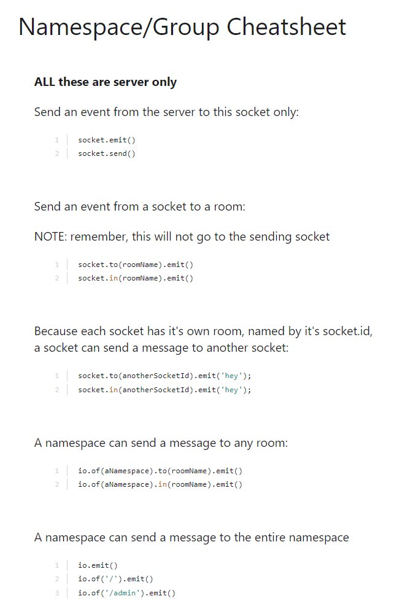

## I Socket.io S Y N T A X for the .on() method
- emitter.on(eventName, listener)
- eventName - data-type is a string and is the name of the event
- listener - data-type is a function and a callback function
- .on() returns an EventEmitter object 
- [doc src](https://nodejs.org/api/events.html#events_emitter_on_eventname_listener)
---

## II Socket.io S Y N T A X for the .emit() method
- emitter.emit(eventName[, ...args])
- eventName - data-type is a string (or a symbol) and is the name of the event
- ...args - data-type can be anything
- .emit() returns a boolean value
- [doc src](https://nodejs.org/api/events.html#events_emitter_emit_eventname_args)
---
## IIIA - Socket.io S Y N T A X for [io()](https://socket.io/docs/v4/client-api/) which is exposed as the io namespace in the standalone build or the result of calling:
~~~

~~~
or
~~~
const io = require("socket.io-client");
// or with import syntax
import { io } from "socket.io-client";
~~~
### io([url][, options])
- url (String) (defaults to window.location)
- options (Object)
  - forceNew (Boolean) whether to reuse an existing connection
- io() returns Socket

---
## IIIB - Conceptual Aside - nodejs S Y N T A X for using ES6 Arrow Functions as listeners
### It is possible to use ES6 Arrow Functions as listeners, however, when doing so, the this keyword will no longer reference the EventEmitter instance:
~~~
const myEmitter = new MyEmitter();
myEmitter.on('event', (a, b) => {
  console.log(a, b, this);
  // Prints: a b {}
});
myEmitter.emit('event', 'a', 'b');
~~~
- [doc src](https://nodejs.org/api/events.html#events_passing_arguments_and_this_to_listeners)

---

## IV Events
- Much of the Node.js core API is built around an idiomatic asynchronous event-driven architecture in which certain kinds of objects (called "emitters") emit named events that cause Function objects ("listeners") to be called.
- For instance: a net.Server object emits an event each time a peer connects to it; a fs.ReadStream emits an event when the file is opened; a stream emits an event whenever data is available to be read.
- All objects that emit events are instances of the EventEmitter class. These objects expose an eventEmitter.on() function that allows one or more functions to be attached to named events emitted by the object. Typically, event names are camel-cased strings but any valid JavaScript property key can be used.
- When the EventEmitter object emits an event, all of the functions attached to that specific event are called synchronously. Any values returned by the called listeners are ignored and discarded.
- The following example shows a simple EventEmitter instance with a single listener. The eventEmitter.on() method is used to register listeners, while the eventEmitter.emit() method is used to trigger the event.

~~~
const EventEmitter = require('events');

class MyEmitter extends EventEmitter {}

const myEmitter = new MyEmitter();
myEmitter.on('event', () => {
  console.log('an event occurred!');
});
myEmitter.emit('event');
~~~
---
## V My server would crash with the error below while I was following the socket.io tutorial.  I was inserting a lot of comments/notes which may have caused the error.  In order to troubleshoot below is the code with my notes to save as a reference.  Also, immediately following this is the error message.
## UPDATE - the socketio npm package wasn't installed muahahahahahAHAHAHAHA

~~~
arthu@LAPTOP-S3QG7NKP MINGW64 ~/development/projectWhereWoof/dustyv3/backend/routes/socketio
$ nodemon chat.js
[nodemon] 2.0.4
[nodemon] to restart at any time, enter `rs`
[nodemon] watching path(s): *.*
[nodemon] watching extensions: js,mjs,json
[nodemon] starting `node chat.js`
internal/modules/cjs/loader.js:905
  throw err;
  ^

Error: Cannot find module 'socket.io'
Require stack:
- C:\Users\arthu\development\projectWhereWoof\dustyv3\backend\routes\socketio\chat.js
    at Function.Module._resolveFilename (internal/modules/cjs/loader.js:902:15)
    at Function.Module._load (internal/modules/cjs/loader.js:746:27)
    at Module.require (internal/modules/cjs/loader.js:974:19)
    at require (internal/modules/cjs/helpers.js:92:18)
    at Object.<anonymous> (C:\Users\arthu\development\projectWhereWoof\dustyv3\backend\routes\socketio\chat.js:3:18)
    at Module._compile (internal/modules/cjs/loader.js:1085:14)
    at Object.Module._extensions..js (internal/modules/cjs/loader.js:1114:10)
    at Module.load (internal/modules/cjs/loader.js:950:32)
    at Function.Module._load (internal/modules/cjs/loader.js:790:14)
    at Function.executeUserEntryPoint [as runMain] (internal/modules/run_main.js:76:12) {
  code: 'MODULE_NOT_FOUND',
  requireStack: [
    'C:\\Users\\arthu\\development\\projectWhereWoof\\dustyv3\\backend\\routes\\socketio\\chat.js'
  ]
}
[nodemon] app crashed - waiting for file changes before starting...
~~~
---
### code from chat.js with comments
~~~const express = require('express');
const app = express();
const socketio = require('socket.io')

app.use(express.static(__dirname + '/public'));

// Step 1: the express server is listening to port 9000
const expressServer = app.listen(9000);

// Step 2: the socketio server is listening to the express server
const io = socketio(expressServer);

// Step 3: anytime someone connects to the socketio server then (socket)=>{...} will run which will then: 
io.on('connection',(socket)=>{

    //  (A) emit a message to that socket, while establishing an event called 'messageFromServer', from our server in the form of the {data} object "Welcome to the socketio server".
    socket.emit('messageFromServer',{data:"Welcome to the socketio server"});

    //  (B) listen to that socket for the event called 'messageToServer' and if that event happens then the callback (dataFromClient)=>{...} will run.
    socket.on('messageToServer',(dataFromClient)=>{
        console.log(dataFromClient)
    })
})
~~~
---
### code from chat.html with comments
~~~

~~~
---
## VI The [Server](https://socket.io/docs/v4/server-api/) constructor function is exposed by require("socket.io")
- new Server(httpServer[, options])
  - httpServer (http.Server) the server to bind to.
  - options (Object)
- Works with and without new:
~~~
const io = require("socket.io")();
// or
const { Server } = require("socket.io");
const io = new Server();
~~~
In the above example of:
~~~
const io = require("socket.io")();
~~~
- require("socket.io) exposes the Server constructor and the () invokes it thus creating the server instance.
~~~
const io = new socketio(expressServer,{
  path: '/socket.io', //default value so not necessary
  serveClient: true   //default value so not necessary
});
~~~
### The ['connect' event also synonymous with 'connection'](https://socket.io/docs/v4/server-api/#Namespace) is fired upon a connection from the client to a namespace.
- Event: connection
  - socket (Socket) socket connection with client
- Fired upon a connection from client.
~~~
io.on("connection", (socket) => {
  // ...
});
~~~
- the socket callback function above refers to the connection with the client.
---
## VII The [Socket class](https://socket.io/docs/v4/server-api/#Socket) is the fundamental class for interacting with browser clients. A Socket belongs to a certain Namespace (by default /) and uses an underlying Client to communicate.

It should be noted the Socket doesn’t relate directly to the actual underlying TCP/IP socket and it is only the name of the class.

Within each Namespace, you can also define arbitrary channels (called room) that the Socket can join and leave. That provides a convenient way to broadcast to a group of Sockets (see Socket#to below).

The Socket class inherits from the NodeJS [EventEmitter](https://nodejs.org/api/events.html#events_class_eventemitter). The Socket class overrides the emit method, and does not modify any other EventEmitter method. All methods documented here which also appear as EventEmitter methods (apart from emit) are implemented by EventEmitter, and documentation for EventEmitter applies.

## VIII [Namespaces](https://socket.io/docs/v4/server-api/#Namespace) represents a pool of sockets connected under a given scope identified by a pathname e.g.:  /chat
### namespace. name
- Data-type is a string which is the namespace identifier property.
### namespace.sockets
- Data-type is a (Map<SocketId, Socket>) which is a map of Socket instances that are connected to this namespace.
~~~
// number of sockets in this namespace (on this node)
const socketCount = io.of("/admin").sockets.size;
~~~
### note bene that Namespaces are NOT supported by normal websockets; Namespaces are exlusive to Socket.io.

### In general, as part of a Socket.io server Namespaces contain Rooms in the same way that as part of a Mongo DB server there are databases which contain data tables.
---
## IX [server.of(nsp)](https://socket.io/docs/v4/server-api/#server-of-nsp) initializes and retrieves the given Namespace by its pathname identifier nsp. If the namespace was already initialized it returns it immediately.
- nsp (String|RegExp|Function)
- Returns Namespace
~~~
const adminNamespace = io.of("/admin");
~~~
- A regex or a function can also be provided, in order to create namespace in a dynamic way:
~~~
const dynamicNsp = io.of(/^\/dynamic-\d+$/).on("connection", (socket) => {
  const newNamespace = socket.nsp; // newNamespace.name === "/dynamic-101"

  // broadcast to all clients in the given sub-namespace
  newNamespace.emit("hello");
});

// client-side
const socket = io("/dynamic-101");

// broadcast to all clients in each sub-namespace
dynamicNsp.emit("hello");

// use a middleware for each sub-namespace
dynamicNsp.use((socket, next) => { /* ... */ });
~~~
With a function:
~~~
io.of((name, query, next) => {
  // the checkToken method must return a boolean, indicating whether the client is able to connect or not.
  next(null, checkToken(query.token));
}).on("connection", (socket) => { /* ... */ });
~~~
---
## X - [namespace.emit(eventName[, …args])](https://socket.io/docs/v4/server-api/#namespace-emit-eventName-%E2%80%A6args) emits an event to all connected clients.
- eventName (String)
- args
- Returns true
### The following two are equivalent:
~~~
const io = require("socket.io")();
io.emit("an event sent to all connected clients"); // main namespace

const chat = io.of("/chat");
chat.emit("an event sent to all connected clients in chat namespace");
~~~
---
## XI Namespace Cheatsheet
